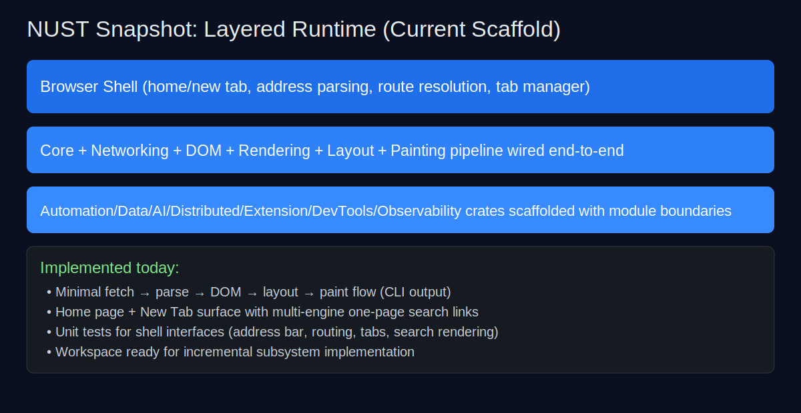
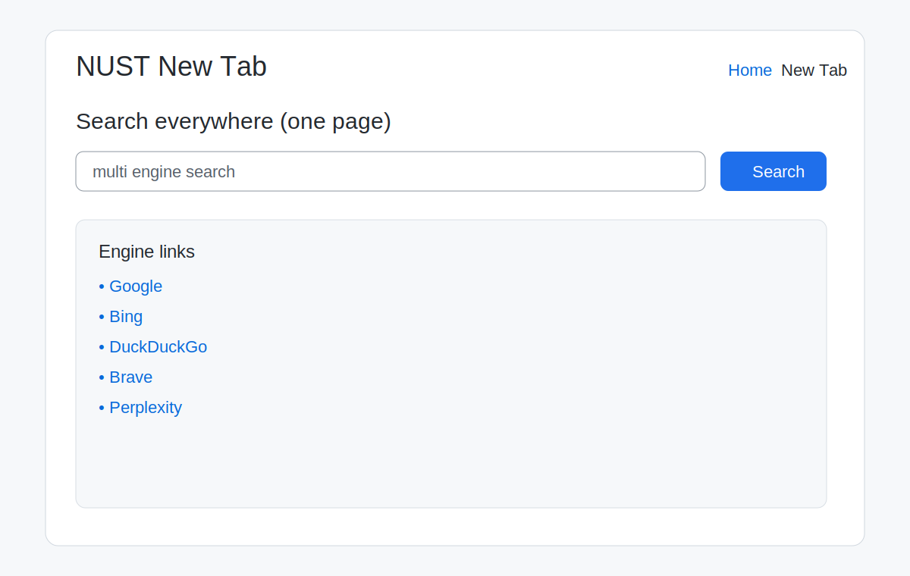

# NUST Browser

Independent programmable browser engine scaffold in Rust.

## Snapshot: what has been built so far

NUST currently includes a modular Rust workspace with subsystem boundaries, a working minimal render pipeline, and initial browser-shell UX for Home/New Tab with multi-engine search.

## Implemented features (current)

- **Workspace architecture**
  - 19 subsystem crates with clear modular boundaries and no circular crate wiring.
- **Minimal rendering pipeline (Phase-1 baseline)**
  - fetch URL (placeholder) → HTML tokenize/parse → DOM build → block layout → text paint commands.
- **Browser shell UX primitives**
  - Home page output (`--home`)
  - New tab page output (`--new-tab <query>`)
  - Address parsing (URL vs search)
  - Navigation route resolver (`home`, `new-tab`, external)
  - In-memory tab manager opening search-ready new tabs.
- **Innovative multi-engine one-pager search**
  - Generates parallel search links for Google, Bing, DuckDuckGo, Brave, and Perplexity on a single page.

- **Design system foundation**
  - Reusable tokens for color, spacing, radius, and typography now drive shell theming and component styles.

- **Modern browser conveniences (new)**
  - Pinned and muted tab state primitives
  - Bookmark folders
  - Searchable/recent history entries
  - Incognito session mode
  - CLI showcase command: `--showcase-modern-features`

### UI skin
- Aurora gradient skin with glass-card panels, chip-style navigation, and stronger action affordances in Home/New Tab surfaces.

## Quick start

- Render pipeline demo:
  - `cargo run -p browser_shell -- https://example.com`
- Home interface:
  - `cargo run -p browser_shell -- --home`
- New tab one-pager multi-engine search interface:
  - `cargo run -p browser_shell -- --new-tab "rust browser engine"`

## Detailed project snapshot

See `docs/snapshot.md` for a concise status report, limitations, and validation commands.

Deep architecture audit and completeness plan: `docs/engine_gap_discovery_report.md`.

Comprehensive architecture generator blueprint: `docs/architecture_expansion_blueprint.md`.

## Productivity skills bootstrap

To clone productivity repos into your workspace (Codex skills + Antigravity), run:

- `./scripts/install_productivity_skills.sh`
- Optional custom target directory: `./scripts/install_productivity_skills.sh /path/to/dest`

Note: If your environment blocks outbound GitHub traffic (proxy 403), this command will fail until network policy is relaxed.
